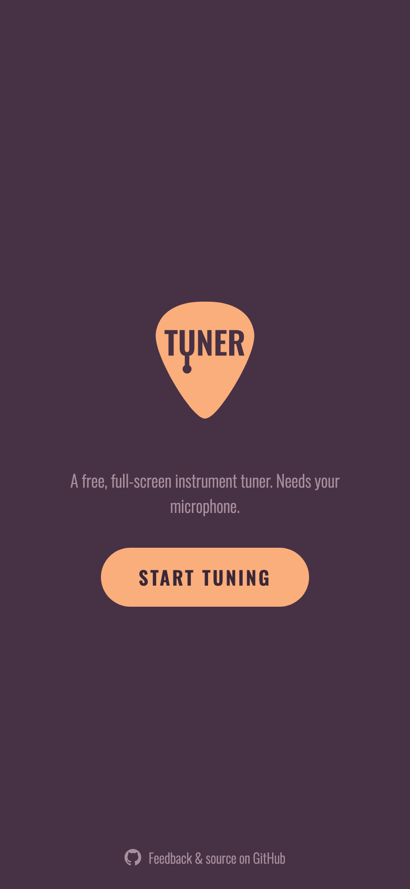
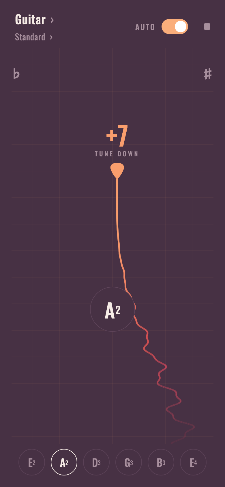

# tuner

A free, full-screen instrument tuner that runs entirely in your browser.

**→ [tuner.gnass.buzz](https://tuner.gnass.buzz)**

No app to install, no account, no network — point your microphone at the
instrument and tune. It's a PWA, so you can add it to your home screen and use
it offline.

<p align="center">
  
  &nbsp;&nbsp;
  
</p>

## Features

- **Multiple instruments** — guitar, bass, and ukulele, plus a free-pitch
  chromatic mode.
- **Common tunings** — standard, Drop D, DADGAD, open G/D, half-step down,
  4/5-string bass, high/low-G and baritone ukulele, and more.
- **Auto string detection** — strum any string and the tuner locks onto the
  nearest target; or pick a string manually.
- **Steady, readable needle** — an adaptive filter holds rock-still on a
  sustained note yet tracks deliberate peg-turns with almost no lag.
- **Octave-safe pitch detection** — built to avoid the classic "off by an
  octave" errors on low strings, and to ignore speech and background noise.
- **Installable & offline** — full PWA with offline caching.

## How it works

Pitch detection is a hybrid, multi-stage pipeline:

1. **Coarse estimate** — [YIN](https://doi.org/10.1121/1.1458024)
   (de Cheveigné & Kawahara, 2002) gives a robust, octave-safe period.
2. **Harmonic refinement** — the harmonic series is located in the FFT spectrum,
   seeded by that estimate, then sharpened with sub-bin interpolation and a
   phase-difference trick.
3. **A-weighting** — harmonics are A-weighted so inaudible low-frequency rumble
   can't bias the averaged fundamental.

Non-tonal signals (like nearby speech) are rejected by a stability gate: the
needle only moves once several consecutive detections agree on a steady pitch,
which a held string passes and wandering speech does not.

The needle is smoothed with a
[One-Euro filter](https://gery.casiez.net/1euro/) (Casiez, Roussel & Vogel,
CHI 2012) operating in the cents domain, so the dynamics feel identical across
the whole range.

## Development

```bash
npm install
npm run dev      # start the dev server
npm run build    # type-check and build for production
npm run preview  # preview the production build
npm test         # run the unit tests (Vitest)
npm run lint     # check formatting and lint rules (Biome)
npm run format   # apply formatting / safe fixes
npm run screenshot  # regenerate the README screenshots (Playwright)
```

The screenshots above are generated, not hand-captured: `?demo` loads a staged
tuning curve in place of the microphone (see `src/hooks/useDemoTuner.ts`), and
`npm run screenshot` drives a headless browser to capture both screens at
780 × 1688. Re-run it whenever the UI changes.

Built with [Preact](https://preactjs.com/), [Vite](https://vite.dev/), and
[vite-plugin-pwa](https://vite-pwa-org.netlify.app/). The microphone is accessed
via the Web Audio API; all processing happens on-device and nothing leaves the
browser.

## License

[MIT](./LICENSE) © Felix Gnass

The bundled [Oswald](https://github.com/googlefonts/OswaldFont) font is licensed
under the [SIL Open Font License 1.1](./public/Oswald-OFL.txt).
